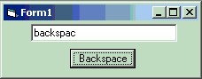

<div align="center">

## \_String Auto Backspace\_


</div>

### Description

With this extremely easy code, you can erase a character at the end of a string or in a textbox with a click of a button. Very easy code and every line is commented. DON'T forget to vote.
 
### More Info
 


<span>             |<span>
---                |---
**Submitted On**   |
**By**             |[Tomas Tupy](https://github.com/Planet-Source-Code/PSCIndex/blob/master/ByAuthor/tomas-tupy.md)
**Level**          |Beginner
**User Rating**    |3.8 (19 globes from 5 users)
**Compatibility**  |VB 5\.0, VB 6\.0
**Category**       |[String Manipulation](https://github.com/Planet-Source-Code/PSCIndex/blob/master/ByCategory/string-manipulation__1-5.md)
**World**          |[Visual Basic](https://github.com/Planet-Source-Code/PSCIndex/blob/master/ByWorld/visual-basic.md)
**Archive File**   |[](https://github.com/Planet-Source-Code/tomas-tupy-string-auto-backspace__1-42674/archive/master.zip)

### API Declarations

```
Dim backlength As Integer
Dim backString As String
```


### Source Code

```
Dim backlength As Integer
'declare the variable in which the length will be stored
Dim backString As String
'declare the string in which Text1 wil be stored
Private Sub Command1_Click()
backlength = Len(Text1.Text)
'find the length of the text in the textbox
backString = Mid(Text1.Text, 1, (backlength - 1))
'save that text without the last character into the string
Text1.Text = backString
'display the string in the text box
End Sub
'You can replace Text1.Text with a string name
```

